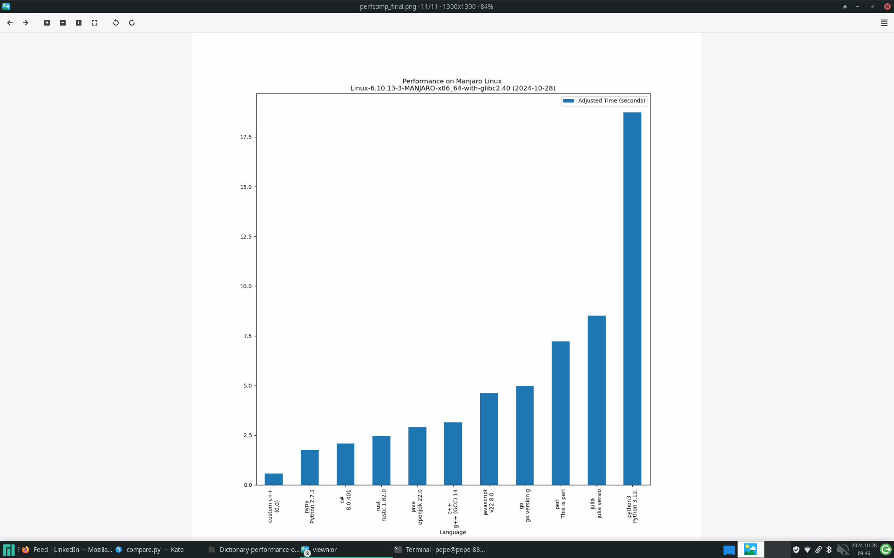
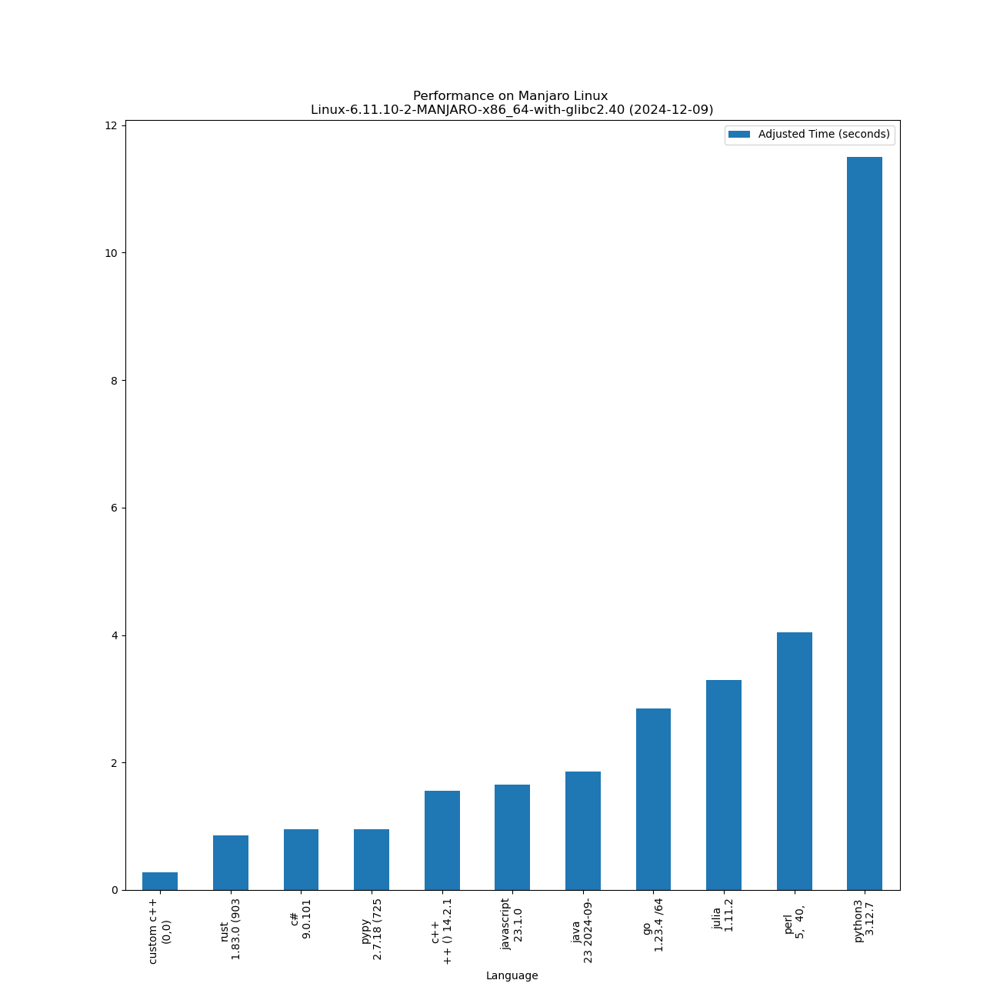

# Performance of various programming languages on basic dictionary + random generation operations

Comparing various programming languages on a [dictionary](https://en.wikipedia.org/wiki/Associative_array) and [random generation operations](https://en.wikipedia.org/wiki/Linear_congruential_generator) - performance of language (lower is better) on a Lenovo IdeaPad laptop.

This was supposed to be single-threaded test, but Go language & Java use a bit more than one thread on a CPU, hence measured times are adjusted to give more fair time scores (adjusted time).

Custom C++ (maincustom.c++) is just to show that in C++ you can often write your own code for your scenario to even further improve performance of your code. It has custom random operations, custom dictionary and custom string to achieve this. Speed improvements can be quite significant. You can probably do so also in C#, but with higher level languages, you probably do not want to spend time on this.

Lower is better - on operating system Alpine Linux (Linux-6.6.50-0-lts-x86_64) on 2024-09-12:

|       Language       |                     Version                     | Adjusted time based on CPU usage (seconds) | Average time (seconds) | Average CPU usage (%) | Average memory usage (%) |
|----------------------|-------------------------------------------------|--------------------------------------------|------------------------|---------------------------|------------------------------|
| custom c++ |                      (0,0)                      |                   0.541                    |         0.476          |           7.103           |            26.341            |
|     c#     |                     8.0.401                     |                   1.317                    |         1.077          |           7.645           |            21.842            |
|    rust    |       rustc 1.81.0 (eeb90cda1 2024-09-04)       |                   1.618                    |         1.378          |           7.339           |            21.044            |
|    c++     | g++ (Alpine 13.2.1_git20240309) 13.2.1 20240309 |                   2.314                    |         1.942          |           7.448           |            21.227            |
| javascript |                     v20.15.1                    |                   2.642                    |         2.081          |           7.937           |            21.443            |
|     go     |         go version go1.23.1 linux/amd64         |                   3.775                    |         2.300          |           10.258          |            21.836            |

One of the runs:

And on Manjaro Linux:

