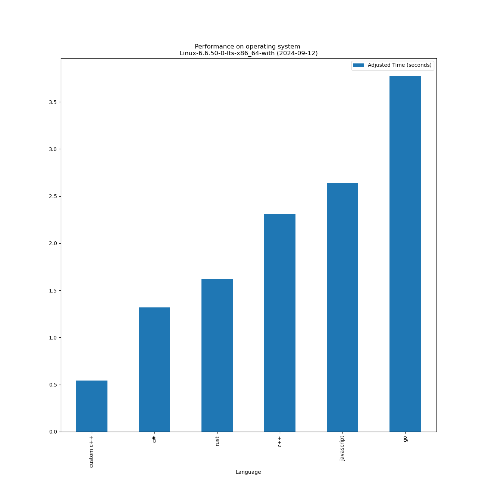
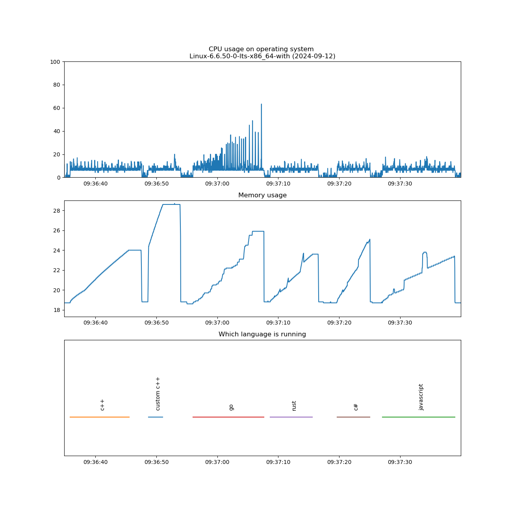
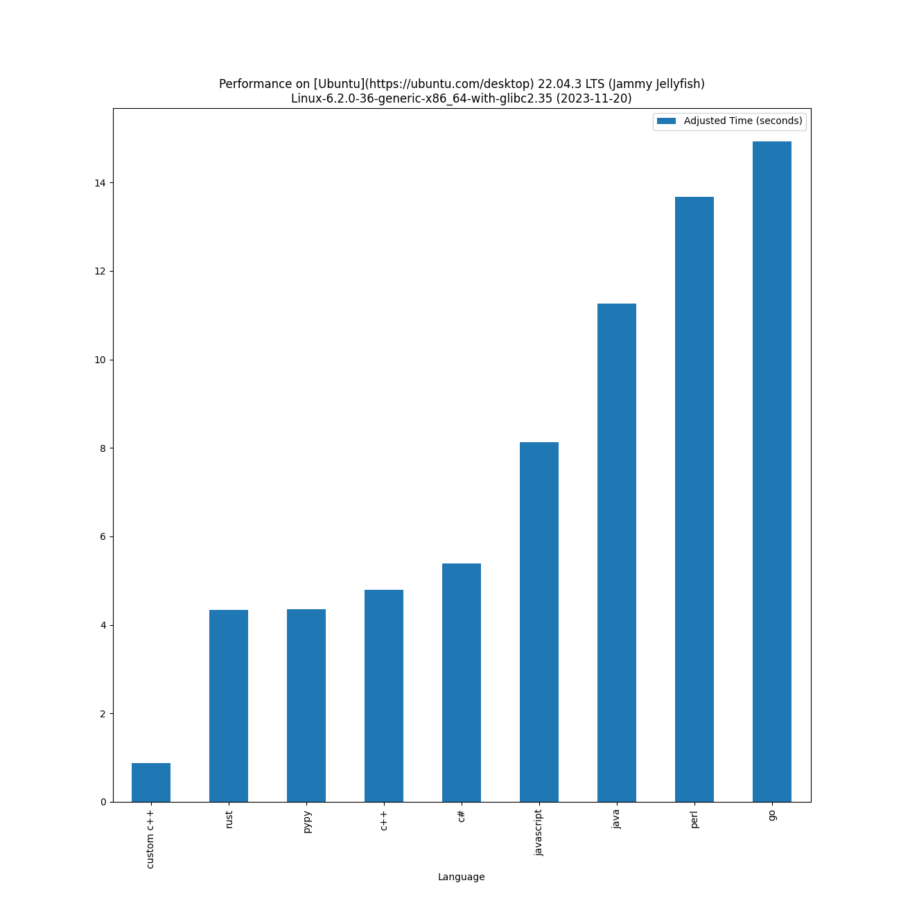
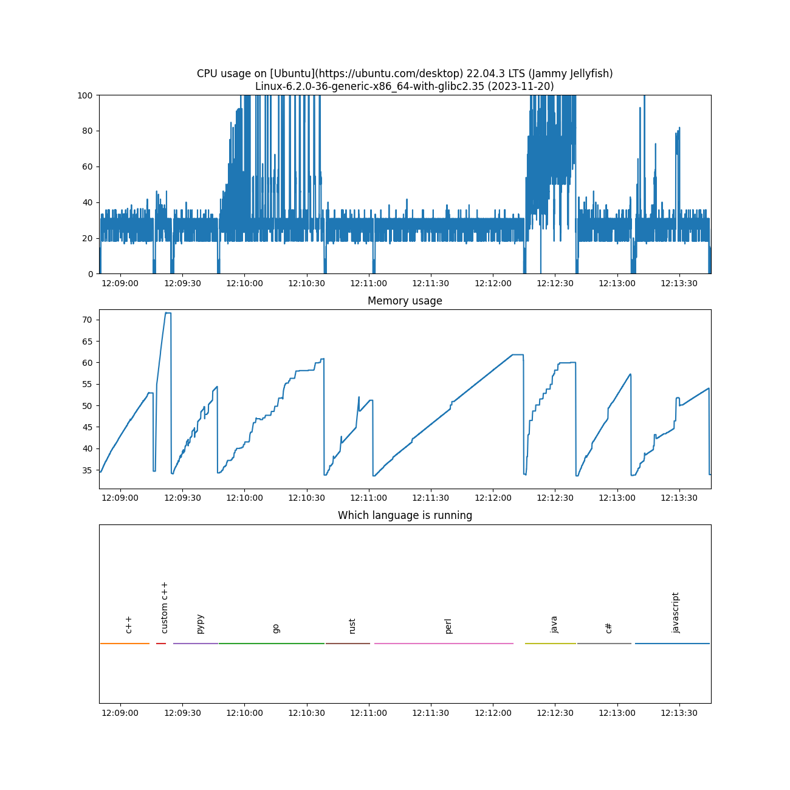
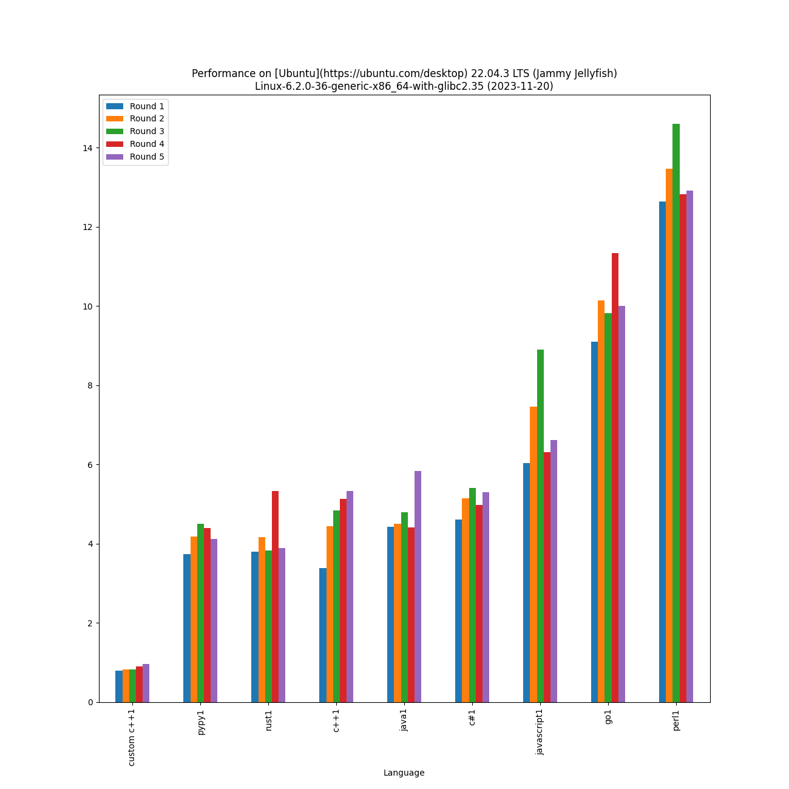

# Performance of various programming languages on basic dictionary + random generation operations

Comparing various programming languages on a [dictionary](https://en.wikipedia.org/wiki/Associative_array) and [random generation operations](https://en.wikipedia.org/wiki/Linear_congruential_generator) - performance of language (lower is better) on a machine:

* Motherboard: [MPG B550 GAMING CARBON WIFI motherboard](https://www.msi.com/Motherboard/MPG-B550-GAMING-CARBON-WIFI)
* CPU: [AMD Ryzen 5 3600X (12) @ 3.800GHz processor](https://www.amd.com/en/products/cpu/amd-ryzen-5-3600x)
* RAM: [CORSAIR](https://www.corsair.com/us/en/) - [128 GB SDRAM DDR4 3200 memory](https://www.newegg.com/corsair-64gb-288-pin-ddr4-sdram/p/N82E16820236586)

This was supposed to be single-threaded test, but Go language & Java use a bit more than one thread on a CPU, hence measured times are adjusted to give more fair time scores (adjusted time).

Custom C++ (maincustom.c++) is just to show that in C++ you can often write your own code for your scenario to even further improve performance of your code. It has custom random operations, custom dictionary and custom string to achieve this. Speed improvements can be quite significant. You can probably do so also in C#, but with higher level languages, you probably do not want to spend time on this.

Lower is better - on [Fedora Linux](https://getfedora.org/) 35 (Workstation Edition)
Linux-5.14.10-300.fc35.x86_64-x86_64-with-glibc2.34 on 2022-05-02:

|                        Language                        |                       Version                       | Adjusted time based on CPU usage (seconds) | Average time (seconds) | Average CPU usage[^1] (%) | Average memory usage[^1] (%) |
|--------------------------------------------------------|-----------------------------------------------------|--------------------------------------------|------------------------|---------------------------|------------------------------|
|         custom c++         |                        (0,0)                        |                   0.328                    |         0.310          |           8.820           |            2.951             |
|       [pypy](https://en.wikipedia.org/wiki/PyPy)       | Python 2.7.18 (d18c191c9483, Oct 29 2021, 13:11:39) |                   1.509                    |         1.433          |           8.778           |            2.343             |
|      [c++](https://en.wikipedia.org/wiki/C%2B%2B)      |     g++ (GCC) 11.3.1 20220421 (Red Hat 11.3.1-2)    |                   1.802                    |         1.696          |           8.851           |            2.346             |
|           [rust](https://www.rust-lang.org/)           |         rustc 1.60.0 (7737e0b5c 2022-04-04)         |                   1.859                    |         1.765          |           8.778           |            2.350             |
| [c#](https://docs.microsoft.com/en-us/dotnet/csharp/)  |                       6.0.202                       |                   2.658                    |         2.519          |           8.793           |            2.479             |
| [javascript](https://en.wikipedia.org/wiki/JavaScript) |                       v16.14.0                      |                   2.928                    |         2.732          |           8.929           |            2.383             |
|                 [go](https://go.dev/)                  |           go version go1.18.1 linux/amd64           |                   5.893                    |         3.770          |           13.028          |            2.466             |
|            [julia](https://julialang.org/)             |                 julia version 1.7.2                 |                   9.310                    |         8.859          |           8.757           |            2.752             |

Lower is better - on [Feren OS](https://ferenos.weebly.com/) 2022.04
Linux-5.13.0-40-generic-x86_64-with-glibc2.29 on 2022-05-02:

|                        Language                        |                                          Version                                           | Adjusted time based on CPU usage (seconds) | Average time (seconds) | Average CPU usage[^1] (%) | Average memory usage[^1] (%) |
|--------------------------------------------------------|--------------------------------------------------------------------------------------------|--------------------------------------------|------------------------|---------------------------|------------------------------|
|         custom c++         |                                           (0,0)                                            |                   0.307                    |         0.304          |           8.414           |            2.666             |
|       [pypy](https://en.wikipedia.org/wiki/PyPy)       |                    Python 2.7.13 (7.3.1+dfsg-2, Apr 21 2020, 05:05:41)                     |                   1.428                    |         1.390          |           8.562           |            2.104             |
|      [c++](https://en.wikipedia.org/wiki/C%2B%2B)      |                         g++ (Ubuntu 9.4.0-1ubuntu1~20.04.1) 9.4.0                          |                   1.530                    |         1.504          |           8.477           |            2.105             |
|           [rust](https://www.rust-lang.org/)           |                            rustc 1.60.0 (7737e0b5c 2022-04-04)                             |                   1.676                    |         1.658          |           8.427           |            2.075             |
| [javascript](https://en.wikipedia.org/wiki/JavaScript) |                                          v10.19.0                                          |                   2.185                    |         1.914          |           9.509           |            2.116             |
| [c#](https://docs.microsoft.com/en-us/dotnet/csharp/)  |                                          6.0.202                                           |                   2.191                    |         2.138          |           8.541           |            2.176             |
|       [perl](https://en.wikipedia.org/wiki/Perl)       | This is perl 5, version 30, subversion 0 (v5.30.0) built for x86_64-linux-gnu-thread-multi |                   5.261                    |         5.209          |           8.417           |            2.236             |
|                 [go](https://go.dev/)                  |                              go version go1.18.1 linux/amd64                               |                   5.320                    |         3.557          |           12.465          |            2.215             |
|            [julia](https://julialang.org/)             |                                    julia version 1.4.1                                     |                   7.054                    |         6.914          |           8.501           |            2.408             |

Lower is better - on [Garuda Linux](https://garudalinux.org/) 
Linux-5.17.4-zen1-1-zen-x86_64-with-glibc2.35 on 2022-05-04:

|                        Language                        |                                        Version                                         | Adjusted time based on CPU usage (seconds) | Average time (seconds) | Average CPU usage[^1] (%) | Average memory usage[^1] (%) |
|--------------------------------------------------------|----------------------------------------------------------------------------------------|--------------------------------------------|------------------------|---------------------------|------------------------------|
|         custom c++         |                                         (0,0)                                          |                   0.300                    |         0.294          |           8.494           |            4.324             |
|       [pypy](https://en.wikipedia.org/wiki/PyPy)       |    Python 2.7.18 (Apr 02 2022, 14:58:34)     |                   1.422                    |         1.390          |           8.521           |            3.779             |
|           [rust](https://www.rust-lang.org/)           |                          rustc 1.60.0 (7737e0b5c 2022-04-04)                           |                   1.587                    |         1.555          |           8.507           |            3.684             |
|      [c++](https://en.wikipedia.org/wiki/C%2B%2B)      |                                    g++ (GCC) 11.2.0                                    |                   1.747                    |         1.697          |           8.578           |            3.753             |
| [javascript](https://en.wikipedia.org/wiki/JavaScript) |                                        v18.1.0                                         |                   2.558                    |         2.348          |           9.079           |            3.753             |
| [c#](https://docs.microsoft.com/en-us/dotnet/csharp/)  |                                        6.0.202                                         |                   2.559                    |         2.473          |           8.624           |            3.884             |
|                 [go](https://go.dev/)                  |                            go version go1.18.1 linux/amd64                             |                   5.563                    |         3.559          |           13.024          |            3.833             |
|       [perl](https://en.wikipedia.org/wiki/Perl)       | This is perl 5, version 34, subversion 1 (v5.34.1) built for x86_64-linux-thread-multi |                   5.725                    |         5.570          |           8.566           |            3.852             |
|            [julia](https://julialang.org/)             |                                  julia version 1.7.2                                   |                   8.393                    |         8.143          |           8.589           |            4.676             |

Lower is better - on [Manjaro Linux](https://manjaro.org/) 
Linux-5.15.32-1-MANJARO-x86_64-with-glibc2.35 on 2022-05-02:

|                        Language                        |                                        Version                                         | Adjusted time based on CPU usage (seconds) | Average time (seconds) | Average CPU usage[^1] (%) | Average memory usage[^1] (%) |
|--------------------------------------------------------|----------------------------------------------------------------------------------------|--------------------------------------------|------------------------|---------------------------|------------------------------|
|         custom c++         |                                         (0,0)                                          |                   0.318                    |         0.302          |           8.780           |            2.551             |
|       [pypy](https://en.wikipedia.org/wiki/PyPy)       |    Python 2.7.18 (Apr 02 2022, 14:58:34)     |                   1.473                    |         1.395          |           8.796           |            2.073             |
|           [rust](https://www.rust-lang.org/)           |                          rustc 1.60.0 (7737e0b5c 2022-04-04)                           |                   1.609                    |         1.574          |           8.517           |            2.003             |
|      [c++](https://en.wikipedia.org/wiki/C%2B%2B)      |                                    g++ (GCC) 11.2.0                                    |                   1.739                    |         1.689          |           8.578           |            2.053             |
| [c#](https://docs.microsoft.com/en-us/dotnet/csharp/)  |                                        6.0.202                                         |                   2.552                    |         2.499          |           8.509           |            2.130             |
| [javascript](https://en.wikipedia.org/wiki/JavaScript) |                                        v17.8.0                                         |                   2.612                    |         2.392          |           9.102           |            2.088             |
|       [perl](https://en.wikipedia.org/wiki/Perl)       | This is perl 5, version 34, subversion 1 (v5.34.1) built for x86_64-linux-thread-multi |                   5.597                    |         5.503          |           8.475           |            2.169             |
|                 [go](https://go.dev/)                  |                            go version go1.18.1 linux/amd64                             |                   5.699                    |         3.671          |           12.938          |            2.139             |
|            [julia](https://julialang.org/)             |                                  julia version 1.7.2                                   |                   8.217                    |         8.086          |           8.468           |            2.443             |

Lower is better - on [Ubuntu](https://en.wikipedia.org/wiki/Ubuntu) 22.04 LTS (Jammy Jellyfish)
Linux-5.15.0-27-generic-x86_64-with-glibc2.35 on 2022-05-02:

|                              Language                             |                                          Version                                           | Adjusted time based on CPU usage (seconds) | Average time (seconds) | Average CPU usage[^1] (%) | Average memory usage[^1] (%) |
|-------------------------------------------------------------------|--------------------------------------------------------------------------------------------|--------------------------------------------|------------------------|---------------------------|------------------------------|
|               custom c++              |                                           (0,0)                                            |                   0.309                    |         0.300          |           8.559           |            2.533             |
|             [pypy](https://en.wikipedia.org/wiki/PyPy)            |                    Python 2.7.18 (7.3.9+dfsg-1, Apr 01 2022, 21:40:34)                     |                   1.446                    |         1.418          |           8.499           |            1.980             |
|                 [rust](https://www.rust-lang.org/)                |                            rustc 1.60.0 (7737e0b5c 2022-04-04)                             |                   1.746                    |         1.733          |           8.397           |            1.957             |
|            [c++](https://en.wikipedia.org/wiki/C%2B%2B)           |                            g++ (Ubuntu 11.2.0-19ubuntu1) 11.2.0                            |                   1.748                    |         1.726          |           8.438           |            1.977             |
|       [javascript](https://en.wikipedia.org/wiki/JavaScript)      |                                          v12.22.9                                          |                   2.180                    |         1.978          |           9.187           |            2.086             |
|       [c#](https://docs.microsoft.com/en-us/dotnet/csharp/)       |                                          6.0.202                                           |                   2.524                    |         2.472          |           8.510           |            2.063             |
| [java](https://en.wikipedia.org/wiki/Java_(programming_language)) |                                  openjdk 18-ea 2022-03-22                                  |                   3.277                    |         1.228          |           22.244          |            4.670             |
|             [perl](https://en.wikipedia.org/wiki/Perl)            | This is perl 5, version 34, subversion 0 (v5.34.0) built for x86_64-linux-gnu-thread-multi |                   5.237                    |         5.222          |           8.358           |            2.095             |
|                       [go](https://go.dev/)                       |                              go version go1.18.1 linux/amd64                               |                   5.663                    |         3.718          |           12.692          |            2.053             |

Lower is better - on [Windows 11](https://www.microsoft.com/en-us/windows/windows-11) compiled to Release version with [Visual Studio Community](https://visualstudio.microsoft.com/vs/community/)[^2] on 2022-05-06:

|                        Language                       | Version | Adjusted time based on CPU usage (seconds) | Average time (seconds) | Average CPU usage[^1] (%) | Average memory usage[^1] (%) |
|-------------------------------------------------------|---------|--------------------------------------------|------------------------|---------------------------|------------------------------|
|         custom c++        |  (0,0)  |                   0.451                    |         0.419          |           8.969           |            6.166             |
| [c#](https://docs.microsoft.com/en-us/dotnet/csharp/) | 6.0.202 |                   1.679                    |         1.607          |           8.705           |            5.691             |
|      [c++](https://en.wikipedia.org/wiki/C%2B%2B)     |    ?    |                   3.585                    |         3.498          |           8.542           |            5.672             |

One of five executions:

Or on computer [HP Laptop 14-dq0xxx](https://support.hp.com/us-en/document/c08172990) with 4GB RAM memory and [Intel® Celeron(R) N4120 CPU](https://www.intel.com/content/www/us/en/products/sku/197309/intel-celeron-processor-n4120-4m-cache-up-to-2-60-ghz/specifications.html) on [Ubuntu](https://ubuntu.com/):

|                              Language                             |                                          Version                                           | Adjusted time based on CPU usage (seconds) | Average time (seconds) | Average CPU usage[^1] (%) | Average memory usage[^1] (%) |
|:-----------------------------------------------------------------:|:------------------------------------------------------------------------------------------:|:------------------------------------------:|:----------------------:|:-------------------------:|:----------------------------:|
|               custom c++              |                                           (0,0)                                            |                   0.872                    |         0.835          |           26.120          |            60.387            |
|                 [rust](https://www.rust-lang.org/)                |                            rustc 1.74.0 (79e9716c9 2023-11-13)                             |                   4.341                    |         4.204          |           25.811          |            43.058            |
|                   [pypy](https://www.pypy.org/)                   |                    Python 2.7.18 (7.3.9+dfsg-1, Apr 01 2022, 21:40:34)                     |                   4.348                    |         4.176          |           26.034          |            41.867            |
|         [c++](https://cplusplus.com/)        |                         g++ (Ubuntu 11.4.0-1ubuntu1~22.04) 11.4.0                          |                   4.789                    |         4.586          |           26.110          |            43.937            |
|            [c#](https://en.wikipedia.org/wiki/C_Sharp_(programming_language))            |                                          8.0.100                                           |                   5.388                    |         5.097          |           26.427          |            44.110            |
|       [javascript](https://en.wikipedia.org/wiki/JavaScript)      |                                          v12.22.9                                          |                   8.122                    |         7.068          |           28.728          |            45.843            |
| [java](https://en.wikipedia.org/wiki/Java_(programming_language)) |                                openjdk 18.0.2-ea 2022-07-19                                |                   11.259                   |         4.847          |           58.074          |            51.289            |
|                   [perl](https://www.perl.org/)                   | This is perl 5, version 34, subversion 0 (v5.34.0) built for x86_64-linux-gnu-thread-multi |                   13.678                   |         13.307         |           25.698          |            46.211            |
|                       [go](https://go.dev/)                       |                              go version go1.21.4 linux/amd64                               |                   14.931                   |         10.046         |           37.158          |            48.454            |

Lower is better - on Manjaro Linux and [AMD Ryzen™ 7 8845HS](https://www.amd.com/en/products/processors/laptop/ryzen/8000-series/amd-ryzen-7-8845hs.html)
Linux-6.9.2-1-MANJARO-x86_64-with-glibc2.39 on 2024-06-06:

|  Language  |                                        Version                                         | Adjusted time based on CPU usage (seconds) | Average time (seconds) | Average CPU usage[^1] (%) | Average memory usage[^1] (%) |
| :--------: | :------------------------------------------------------------------------------------: | :----------------------------------------: | :--------------------: | :-----------------------: | :--------------------------: |
| custom c++ |                                         (0,0)                                          |                   0.440                    |         0.295          |           9.327           |            28.946            |
|    rust    |                          rustc 1.78.0 (9b00956e5 2024-04-29)                           |                   1.381                    |         0.924          |           9.343           |            24.828            |
|    pypy    |                  Python 2.7.18 (6aa1e9d13975, Apr 24 2024, 01:57:47)                   |                   1.385                    |         0.926          |           9.342           |            18.342            |
|     c#     |                                        8.0.100                                         |                   1.639                    |         1.189          |           8.617           |            18.682            |
| javascript |                                        v22.2.0                                         |                   2.749                    |         1.741          |           9.870           |            23.310            |
|    c++     |                               g++ (GCC) 14.1.1 20240522                                |                   2.992                    |         1.803          |           10.371          |            18.875            |
|     go     |                            go version go1.21.4 linux/amd64                             |                   4.144                    |         2.118          |           12.227          |            19.043            |
|   julia    |                                  julia version 1.10.3                                  |                   5.023                    |         3.381          |           9.285           |            17.028            |
|    perl    | This is perl 5, version 38, subversion 2 (v5.38.2) built for x86_64-linux-thread-multi |                   5.076                    |         3.656          |           8.677           |            19.506            |

Note: if you run this script (./run.sh), make sure nothing else is running on your machine until the end, or it can influence end results. I quit all other software before running it and set power savings on 'Never' temporarily.

[^1]: Includes Operating System

[^2]: This was done semi manually and there is no script for Windows

